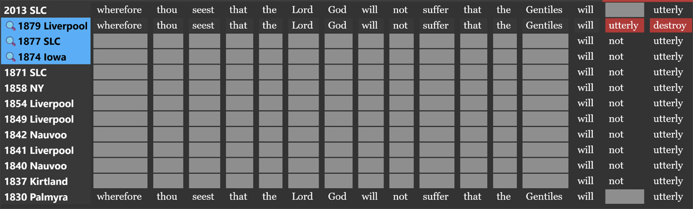
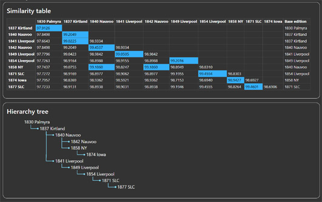

# The Historical Book of Mormon Project

An open-source project to track, visualize, and analyze the textual evolution of the Book of Mormon across nearly
200 years and over 40 printed editions.

## Purpose

This project brings a rigorous, data-driven approach to a long-standing academic and religious question: how has
the Book of Mormon changed over time?

Despite official claims of minimal change (mostly editorial), thousands of documented textual alterations
exist between the original 1829 manuscript and the modern edition. However, this is not the full story. This project
is working on comparing every publicly available edition to allow interested parties to see how the text has
evolved over time across multiple editions.

## Project Status

- Completed: Initial OCR and edition ingestion complete
- Ongoing: OCR cleanup and alignment (10 of 40 editions)
- Planned: Web-based interactive edition viewer and visual analysis tools

## Goals

- Designed to be academically robust and independently verifiable.

- **Custom software tool**

  - **Automatic OCR of multiple editions using Tesseract AI**  
    *Status: Complete*  
  
  - **Manually audit OCR and align editions' texts**  
    *Status: 25% Complete*
    
  
  - **Automatic Edition Lineage Analysis**  
    *Status: Completed*  
    Compute the textual lineage of editions, identifying which editions influenced which others.
    

- **Website**  
  *Status: Not started*  

  - **Editions explorer**  
    Read any page of any edition and instantly see where changes have been made via clear visual indicators.
  
  - **Edit Pattern Analysis**  
    Explore common types of changes, such as the removal of "And it came to pass", and count how often
     and where they occurred.
  
  - **Historical Visualization**  
    Interactive tools to explore how the Book of Mormon evolved over time.
  

## License

MIT
